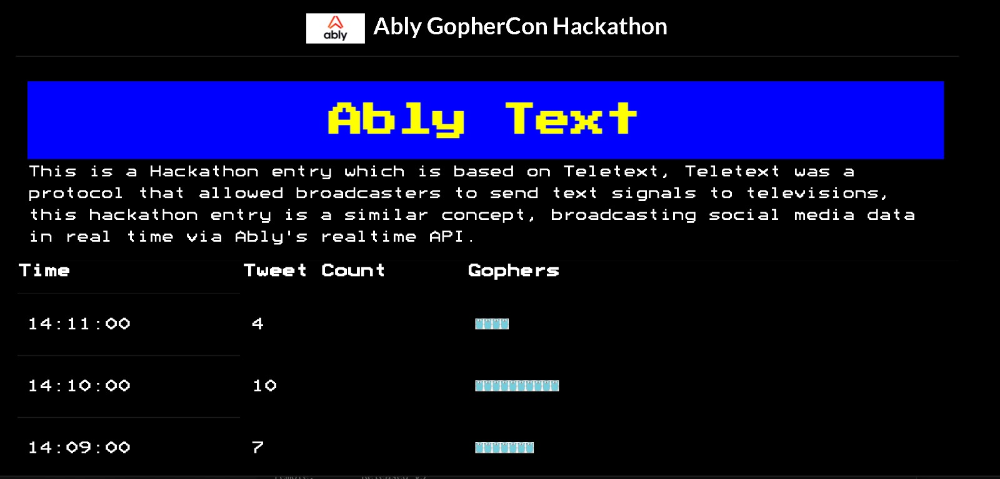
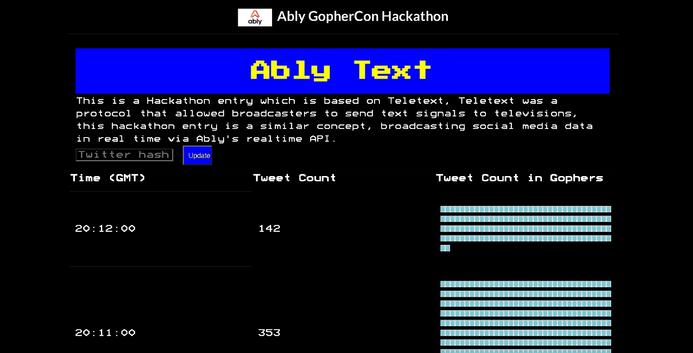

[](https://github.com/Alttaf/ably-hack/actions/workflows/go.yml)
[](https://golang.org/)
[](https://goreportcard.com/report/github.com/alttaf/ably-hack)
[](https://github.com/alttaf/ably-hack/blob/main/LICENSE.md)

# Ably Hackathon Entry: Ably Text
```

 █████  ██████  ██      ██    ██     ████████ ███████ ██   ██ ████████ 
██   ██ ██   ██ ██       ██  ██         ██    ██       ██ ██     ██    
███████ ██████  ██        ████          ██    █████     ███      ██    
██   ██ ██   ██ ██         ██           ██    ██       ██ ██     ██    
██   ██ ██████  ███████    ██           ██    ███████ ██   ██    ██    
```

## About
This is an [Ably GopherCon 2021 Hackathon](https://github.com/ably-labs/Gophercon-Hackathon) entry based on [Teletext](https://en.wikipedia.org/wiki/Teletext).

Teletext was a protocol that allowed broadcasters to send text signals to televisions. This project is a similar concept, broadcasting tweet counts for a given hashtag in real time, via [Ably](https://ably.com)'s realtime API.

Visit the site at <https://mighty-lake-60203.herokuapp.com> to see the data in real time.
The default display is for the keyword "google", due to this keyword reliably matching tweets every minute! ([this search](https://twitter.com/search?q=google&src=typed_query&f=live) shows the equivalent data in Twitter).

The table automatically updates in real time: a new entry will be added at the top as each new minute passes, with data from the last two hours being shown.



This repo contains the backend code, see <https://github.com/Alttaf/ably-fe> for the frontend

### Dev process
We did have a search bar where you could update the displayed tweet counts dynamically on the page:

This however caused us to encounter rate limits for both the Twitter and the Ably APIs! So we have reverted to the static keyword of "google" for the demo which is live.

## Running locally
1. Copy and paste `.env.example` file
2. Rename to `.env`
3. Fill in the specified values
4. Run `go run ably-text`

## Future work
This could further be expanded to:
- Track sentiment analysis of hashtags (events) in real-time:
  - Keep track of the sentiment of certain events
  - Monitor multiple events, see which has the highest overall positive sentiment, and most negative sentiment

## Documentation error
See [DOCS.md](./_docs/DOCS.md) for a documentation error 

## Contributors
1. [Alttaf Hussain](https://github.com/alttaf)
2. [Ed Harrod](https://github.com/echarrod)
